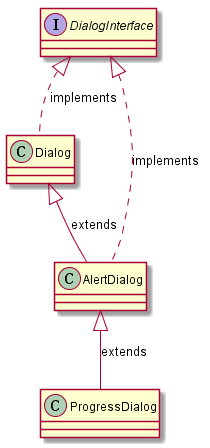
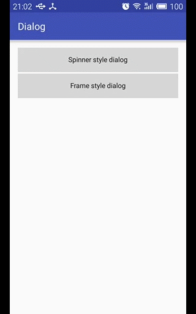
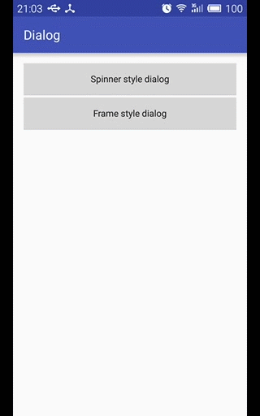
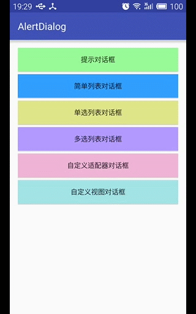
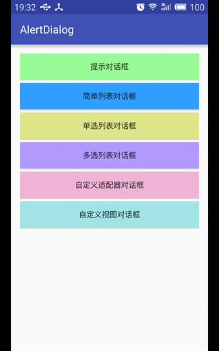
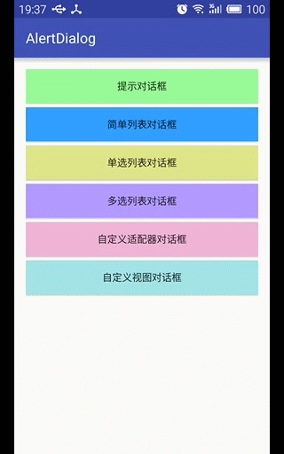
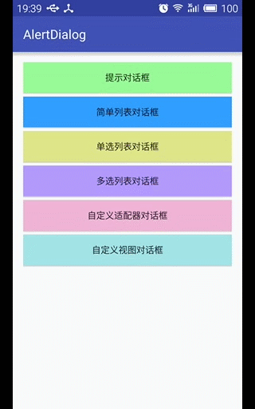
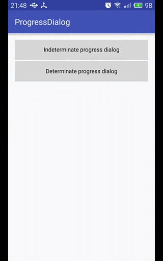

## Dialog/AlertDialog/ProgressDialog关系类图



## Dialog

#### 1. 圆形旋转进度样式

```java
public Dialog createSpinnerDialog(Context context, String msg) {
    LayoutInflater inflater = LayoutInflater.from(context);
    View view = inflater.inflate(R.layout.spinner_style_dialog, null);

    LinearLayout linearLayout = (LinearLayout) view.findViewById(R.id.ll_spinner_dialog);
    ImageView imageView = (ImageView) view.findViewById(R.id.iv_spinner);
    TextView textView = (TextView) view.findViewById(R.id.tv_spinner);

    Animation animation = AnimationUtils.loadAnimation(context, R.anim.loading_animation);
    imageView.startAnimation(animation);

    textView.setText(msg);

    Dialog dialog = new Dialog(context, R.style.loading_dialog);
    dialog.setCancelable(true);         // 设置按返回键时取消对话框
    dialog.setCanceledOnTouchOutside(false);    // 设置点击对话框外部时不取消对话框，默认为true
    dialog.setContentView(linearLayout, new LinearLayout.LayoutParams(
            LinearLayout.LayoutParams.MATCH_PARENT,
            LinearLayout.LayoutParams.MATCH_PARENT
    ));
    return dialog;
}
```

创建对话框并显示

```java
createSpinnerDialog(this, "正在加载中...").show();
```

效果演示



#### 2. 帧动画进度样式

```java
public Dialog createFrameDialog(Context context, String msg){
    LayoutInflater inflater = LayoutInflater.from(context);
    View view = inflater.inflate(R.layout.frame_style_dialog, null);

    LinearLayout linearLayout = (LinearLayout) view.findViewById(R.id.ll_frame_dialog);
    ImageView imageView = (ImageView) view.findViewById(R.id.iv_frame);
    TextView textView = (TextView) view.findViewById(R.id.tv_frame);

    AnimationDrawable ad = (AnimationDrawable) imageView.getDrawable();
    ad.start();

    textView.setText(msg);

    Dialog dialog = new Dialog(context, R.style.loading_dialog);    //
    dialog.setCancelable(true);         // 设置按返回键时取消对话框
    dialog.setCanceledOnTouchOutside(false);    // 设置点击对话框外部时不取消对话框，默认为true
    dialog.setContentView(linearLayout, new LinearLayout.LayoutParams(
            LinearLayout.LayoutParams.MATCH_PARENT,
            LinearLayout.LayoutParams.MATCH_PARENT
    ));
    return dialog;
}
```

创建对话框并显示

```java
createFrameDialog(this, "正在加载中...").show();
```

效果演示



## AlertDialog

#### 1. 提示对话框

```java
private void showAlertDialog() {
    // 使用建造者模式创建对话框
    AlertDialog.Builder builder = new AlertDialog.Builder(this);
    builder.setIcon(R.drawable.ic_android_green_a700_24dp);     // 图标
    builder.setTitle(R.string.text_alert_title);                // 标题
    builder.setMessage(R.string.text_alert_msg);                // 消息内容
    // 确定性质的按钮 (是，有，确定)
    builder.setPositiveButton(R.string.text_alert_btn_positive, new DialogInterface.OnClickListener() {
        @Override
        public void onClick(DialogInterface dialog, int which) {
            Toast.makeText(MainActivity.this, R.string.text_alert_btn_positive_tip, Toast.LENGTH_SHORT).show();
        }
    });
    // 否定性质的按钮 (否，没有，取消)
    builder.setNegativeButton(R.string.text_alert_btn_negative, new DialogInterface.OnClickListener() {
        @Override
        public void onClick(DialogInterface dialog, int which) {
            Toast.makeText(MainActivity.this, R.string.text_alert_btn_negative_tip, Toast.LENGTH_SHORT).show();
        }
    });
    // 中立性质的按钮 (不确定，沉默，保密，忽略，详细)
    builder.setNeutralButton(R.string.text_alert_btn_neutral, new DialogInterface.OnClickListener() {
        @Override
        public void onClick(DialogInterface dialog, int which) {
            Toast.makeText(MainActivity.this, R.string.text_alert_btn_neutral_tip, Toast.LENGTH_SHORT).show();
        }
    });
    // 通过建造者来创建对话框
    AlertDialog dialog = builder.create();      // -
    // 显示对话框
    dialog.show();                              // -

    // 直接使用建造者显示对话框
    // builder.show();                             // +
}
```

效果演示



#### 2. 简单列表对话框

```java
private void showSimpleListDialog() {
    AlertDialog.Builder builder = new AlertDialog.Builder(this);
    // builder.setTitle(R.string.text_list_simple_title);
    final String[] platforms = getResources().getStringArray(R.array.platforms);
    // 设置简单列表的子项内容
    builder.setItems(platforms, new DialogInterface.OnClickListener() {
        @Override
        public void onClick(DialogInterface dialog, int which) {
            Toast.makeText(MainActivity.this, "Selected: " + platforms[which], Toast.LENGTH_SHORT).show();
        }
    });
    builder.show();
}
```

效果演示



#### 3. 单选列表对话框

```java
private void showRadioListDialog() {
    AlertDialog.Builder builder = new AlertDialog.Builder(this);
    builder.setTitle(R.string.text_list_radio_title);
    final String[] cities = getResources().getStringArray(R.array.cities);
    int checkedItem = 0;
    final String[] result = {cities[checkedItem]};
    // 设置单选子项的内容
    builder.setSingleChoiceItems(cities, checkedItem, new DialogInterface.OnClickListener() {
        @Override
        public void onClick(DialogInterface dialog, int which) {
            result[0] = cities[which];
        }
    });
    builder.setPositiveButton(R.string.text_list_radio_btn_positive, new DialogInterface.OnClickListener() {
        @Override
        public void onClick(DialogInterface dialog, int which) {
            Toast.makeText(MainActivity.this, "Selected: " + result[0], Toast.LENGTH_SHORT).show();
        }
    });
    builder.setNegativeButton(R.string.text_list_radio_btn_negative, new DialogInterface.OnClickListener() {
        @Override
        public void onClick(DialogInterface dialog, int which) {
            Toast.makeText(MainActivity.this, "Default: " + result[0], Toast.LENGTH_SHORT).show();
        }
    });
    builder.show();
}
```

效果演示


#### 4. 多选列表对话框

```java
private void showCheckListDialog() {
    AlertDialog.Builder builder = new AlertDialog.Builder(this);
    builder.setTitle(R.string.text_list_check_title);
    final String[] languages = getResources().getStringArray(R.array.languages);
    final List<String> results = new ArrayList<>();
    // 设置多选子项内容
    builder.setMultiChoiceItems(languages, null, new DialogInterface.OnMultiChoiceClickListener() {
        @Override
        public void onClick(DialogInterface dialog, int which, boolean isChecked) {
            if (isChecked) {
                results.add(languages[which]);
            } else {
                results.remove(languages[which]);
            }
        }
    });
    builder.setPositiveButton(R.string.text_list_check_btn_positive, new DialogInterface.OnClickListener() {
        @Override
        public void onClick(DialogInterface dialog, int which) {
            Toast.makeText(MainActivity.this, results.toString(), Toast.LENGTH_SHORT).show();
        }
    });
    builder.setNegativeButton(R.string.text_list_check_btn_negative, new DialogInterface.OnClickListener() {
        @Override
        public void onClick(DialogInterface dialog, int which) {
            Toast.makeText(MainActivity.this, R.string.text_list_check_btn_negative, Toast.LENGTH_SHORT).show();
            results.clear();
        }
    });
    builder.show();
}
```

效果演示



#### 5. 自定义适配器对话框

```java
private void showCustomAdapterDialog() {
    AlertDialog.Builder builder = new AlertDialog.Builder(this);

    final List<User> mUserList = new ArrayList<>();
    mUserList.add(new User(R.drawable.ic_user_avatar, "Stephen Curry"));
    mUserList.add(new User(R.drawable.ic_user_avatar, "Kevin Durant"));
    CustomAdapter adapter = new CustomAdapter(this, mUserList);
    // 设置自定义数据适配器，用于内部的ListView
    builder.setAdapter(adapter, new DialogInterface.OnClickListener() {
        @Override
        public void onClick(DialogInterface dialog, int which) {
            Toast.makeText(MainActivity.this, "Selected: " + mUserList.get(which).getName(), Toast.LENGTH_SHORT).show();
        }
    });
    builder.show();
}
```

效果演示



#### 6. 自定义视图对话框

```java
private void showCustomViewDialog() {
    AlertDialog.Builder builder = new AlertDialog.Builder(this);
    builder.setIcon(R.drawable.ic_user_signin);
    builder.setTitle(R.string.text_custom_view_title);
    // builder.setView(R.layout.layout_signin);    // API21
    final View view = getLayoutInflater().inflate(R.layout.layout_signin, null);
    builder.setView(view);      // 设置自定义内容视图
    builder.setPositiveButton(R.string.text_custom_view_btn_positive, new DialogInterface.OnClickListener() {
        @Override
        public void onClick(DialogInterface dialog, int which) {
            EditText mUsernameEt = (EditText) view.findViewById(R.id.et_username);
            EditText mPasswordEt = (EditText) view.findViewById(R.id.et_password);
            String username = mUsernameEt.getText().toString();
            String password = mPasswordEt.getText().toString();
            String info = String.format(Locale.getDefault(), "[%s:%s]", username, password);
            Toast.makeText(MainActivity.this, info, Toast.LENGTH_SHORT).show();
        }
    });
    builder.setNegativeButton(R.string.text_custom_view_btn_negative, new DialogInterface.OnClickListener() {
        @Override
        public void onClick(DialogInterface dialog, int which) {
            Toast.makeText(MainActivity.this, R.string.text_custom_view_btn_negative, Toast.LENGTH_SHORT).show();
        }
    });
    builder.show();
}
```

效果演示


## ProgressDialog

#### ProgressDialog基本使用说明
**1. 创建ProgressDialog的两种方式**

- 使用new来创建一个ProgressDialog实例
```java
ProgressDialog dialog = new ProgressDialog(this);
dialog.show();
```
- 调用ProgressDialog中的静态方法show()
```java
ProgressDialog dialog = ProgressDialog.show(this, null, "正在加载...");
```

静态方法show()的参数说明
```java
public static ProgressDialog show(
    Context context,                // 上下文 
    CharSequence title,             // 标题
    CharSequence message,           // 消息内容
    boolean indeterminate,          // 不确定性，false为不确定性样式，true为确定性样式
    boolean cancelable,             // 是否可以取消
    OnCancelListener cancelListener // 取消事件监听器
);
```

**2. 取消ProgressDialog对话框**
`Dialog.cancel()`和`Dialog.dismiss()`都可以删除对话框，但是使用`cancel()`方法会在删除对话框时回调`DialogInterface.OnCancelListener`监听器中的`onCancel()`方法，而`dismiss()`则不会进行回调。

**3. 设置ProgressDialog进度条样式**

```java
dialog.setProgressStyle(ProgressDialog.STYLE_HORIZONTAL);   // 设置水平进度条
dialog.setProgressStyle(ProgressDialog.STYLE_SPINNER);      // 设置圆形旋转进度条
```

#### ProgressDialog使用示例

**1. 圆形旋转进度条**

```java
private void createIndeterminateProgressDialog() {
    final ProgressDialog dialog = ProgressDialog.show(this, null, "正在加载...");
    new Thread(new Runnable() {
        @Override
        public void run() {
            try {
                Thread.sleep(3000);
                dialog.dismiss();
            } catch (InterruptedException e) {
                e.printStackTrace();
            }
        }
    }).start();
}
```

效果演示


**2. 水平进度条**

```java
private void createDeterminateProgressDialog() {
    final ProgressDialog dialog = new ProgressDialog(this);
    dialog.setIcon(R.drawable.ic_action_download);  // 设置图标
    dialog.setTitle("当前下载进度");          // 设置标题
    dialog.setMessage("正在加载中...");      // 设置消息内容
    dialog.setProgressStyle(ProgressDialog.STYLE_HORIZONTAL);  // 设置水平进度条
    dialog.setMax(100);     // 设置最大进度值
    dialog.setCancelable(true);                 // 设置是否可以通过点击Back键取消
    dialog.setCanceledOnTouchOutside(false);    // 设置在点击Dialog外是否取消Dialog进度条
    dialog.setButton(DialogInterface.BUTTON_POSITIVE, "确定", new DialogInterface.OnClickListener() {
        @Override
        public void onClick(DialogInterface dialog, int which) {
            Toast.makeText(MainActivity.this, "确定", Toast.LENGTH_SHORT).show();
        }
    });
    dialog.setButton(DialogInterface.BUTTON_NEUTRAL, "忽略", new DialogInterface.OnClickListener() {
        @Override
        public void onClick(DialogInterface dialog, int which) {
            Toast.makeText(MainActivity.this, "忽略", Toast.LENGTH_SHORT).show();
        }
    });
    dialog.setButton(DialogInterface.BUTTON_NEGATIVE, "取消", new DialogInterface.OnClickListener() {
        @Override
        public void onClick(DialogInterface dialog, int which) {
            Toast.makeText(MainActivity.this, "取消", Toast.LENGTH_SHORT).show();
        }
    });
    // 按Back键事件监听
    dialog.setOnCancelListener(new DialogInterface.OnCancelListener() {
        @Override
        public void onCancel(DialogInterface dialog) {
            Toast.makeText(MainActivity.this, "Cancel", Toast.LENGTH_SHORT).show();
        }
    });
    dialog.show();

    new Thread(new Runnable() {
        @Override
        public void run() {
            int i = 0;
            while (i < 100) {
                try {
                    i += 5;
                    Thread.sleep(200);              // 5000ms
                    dialog.incrementProgressBy(5);  // 更新进度
                } catch (InterruptedException e) {
                    e.printStackTrace();
                }
            }
            try {
                Thread.sleep(200);
            } catch (InterruptedException e) {
                e.printStackTrace();
            }
            dialog.dismiss();
        }
    }).start();
}
```

效果演示



## Contacts

**Blog: [shellever](http://www.jianshu.com/users/22e9a407c7c1/latest_articles)**

**Email: shellever@163.com**

**Enjoy yourself!**